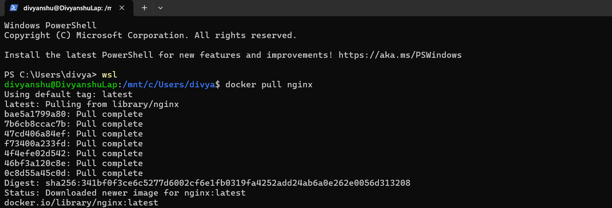
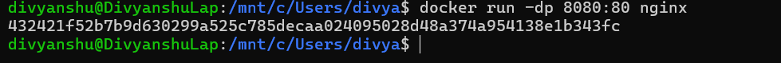
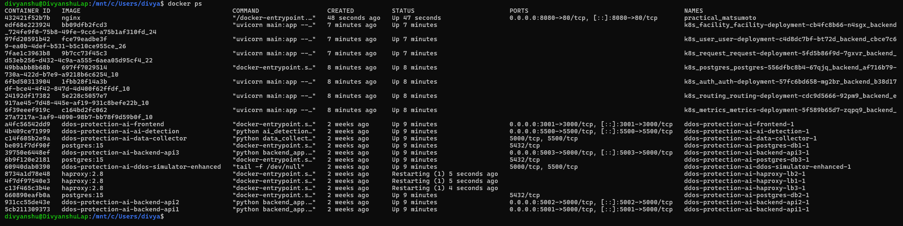
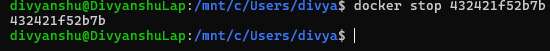
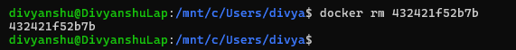
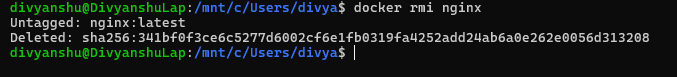

# Lab Report: Experiment 2
## Docker Installation, Configuration, and Running Images

**Date:** 2/2/2026 
**Author:** Divyanshu Gaur

---

## 1. Objective
The objective of this lab is to:
* Pull Docker images
* Run containers
* Manage container lifecycle

---

## 2. Procedure and Results

### Step 1: Pull Image
The first step involves fetching the Nginx image from Docker Hub
* **Command:** `docker pull nginx` 
**Execution Screenshot:**

---

### Step 2: Run Container with Port Mapping
The container is started in detached mode with host port 8080 mapped to container port 80.
* **Command:** `docker run -dp 8080:80 nginx`

**Execution Screenshot:**

---

### Step 3: Verify Running Containers
To confirm the container is active and check the assigned status and ports, the `ps` command is used[cite: 15].
* **Command:** `docker ps`

**Execution Screenshot:**

---

### Step 4: Stop and Remove Container
To manage the lifecycle, the container is stopped first and then removed using its ID.
* **Stop Command:** `docker stop 432421f52b7b` 
* **Remove Command:** `docker rm 432421f52b7b` 

**Stop Screenshot:**

**Remove Screenshot:**

---

### Step 5: Remove Image
The final step in the lifecycle management is removing the image from the local repository.
* **Command:** `docker rmi nginx`

**Execution Screenshot:**

---

## 3. Result and Conclusion
### Result
Docker images were successfully pulled, containers executed, and lifecycle commands performed.

### Overall Conclusion
This lab demonstrated containerization using Docker, highlighting clear performance and resource efficiency. Containers are better suited for rapid deployment and microservices, whereas VMs provide stronger isolation.
